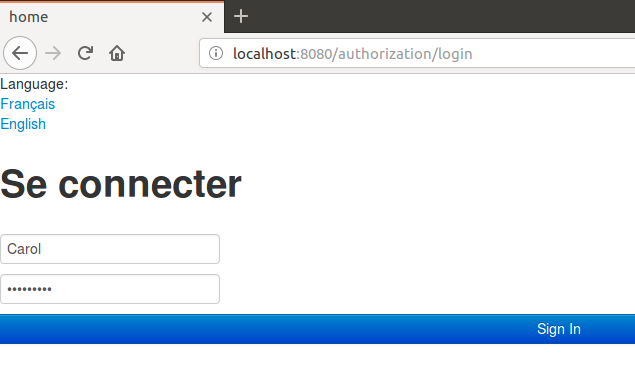
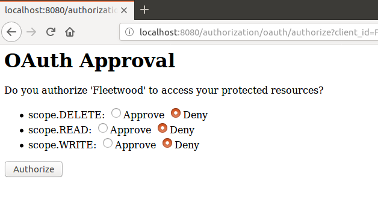

# sharewood-oauth2-upgrade
I present here an upgrade of the previous project https://github.com/dubersfeld/sharewood-boot-oauth2. It uses Spring Boot version 2.0.3. Moreover it is more focused on OAuth2.

Here is the technology stack needed for running the complete application:

Any Linux platform (I use Ubuntu 18.04)

MySQL server installed (I use version 8.0.20)

A recent Apache Maven version installed (I used 3.6.0)

In addition I used Spring Tool Suite for developing this demo but it is not required for running the application.

The complete application is comprised of an OAuth2 authorization server and an OAuth2 resource server. A standalone OAuth2 client is also used.

The authorization server and the resource server share the same database that persists users, tokens and client. All user passwords and client secret are explicitly stored as BCrypt hashes.

Project name         | Port | Database 
-------------------  | ----------------------
authorization-server | 8080 | sharewoodBootDB
sharewood            | 8081 | sharewoodBootDB


Here are the steps to run the application.

## 1. Database creation

In MySQL client run the command:
```
SOURCE sharewoodBootDB.sql
```

This creates a unique database named sharewoodBootDB.

## 2. JAR files creation

In each project directory:
1. authorization-server
1. sharewood
1. fleetwood

run the Maven command:
```
mvn clean package
```
 
## 3. Launching the application

In each project directory
1. authorization-server
1. sharewood
1. fleetwood

run the Maven command:
```
mvn spring-boot:run
```

Now you can login to the fleetwood client on port 9090. Once logged the user can execute all RESTful request after authenticating to the authorization server and granting to fleetwood the required scope.

The users server is populated with two users Alice and Carol who have the role USER. Their passwords are:
Alice: o8p7e6r5a
Carol: s1a2t3o4r

Now the user is presented the authentication page and approval page shown below:




The most tricky part of this project was to force the correct redirection after a successful login to authorization-server. This is achieved by subclassing the bean AuthenticationSuccessHandler and adding a custom RedirectFilter to the Spring Security filter chain in authorization-server.

Another point of interest is the improvement of the display mechanism in client that is now thread safe by adding a synchronized that was missing in the previous project.

For a video demo of this project follow this link:

https://youtu.be/BTlfbYl4358

For a different implementation using RemoteTokenServices and enabling the helper endpoint /oauth/check_token in authorization-server follow this link:

https://github.com/dubersfeld/sharewood-oauth2-remote
  
